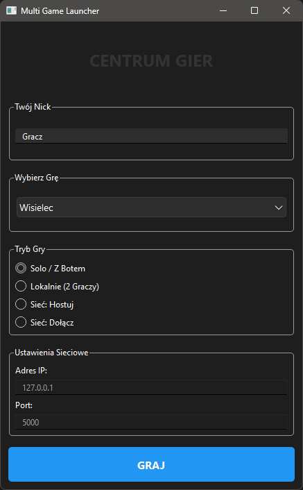
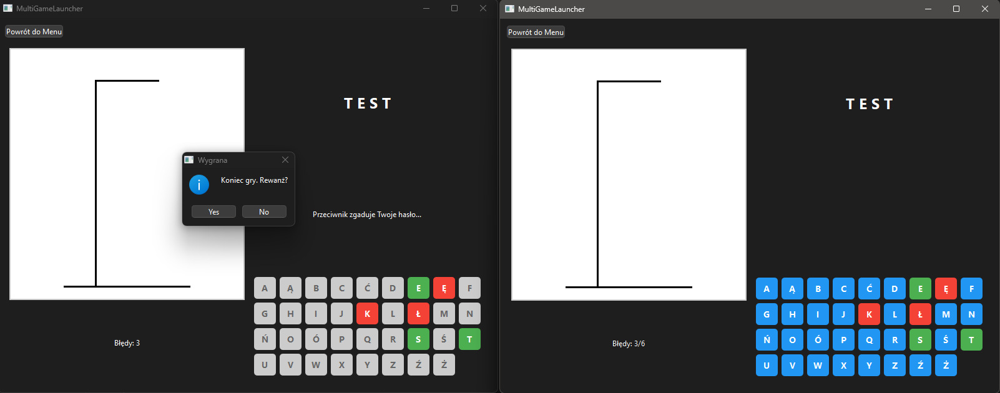
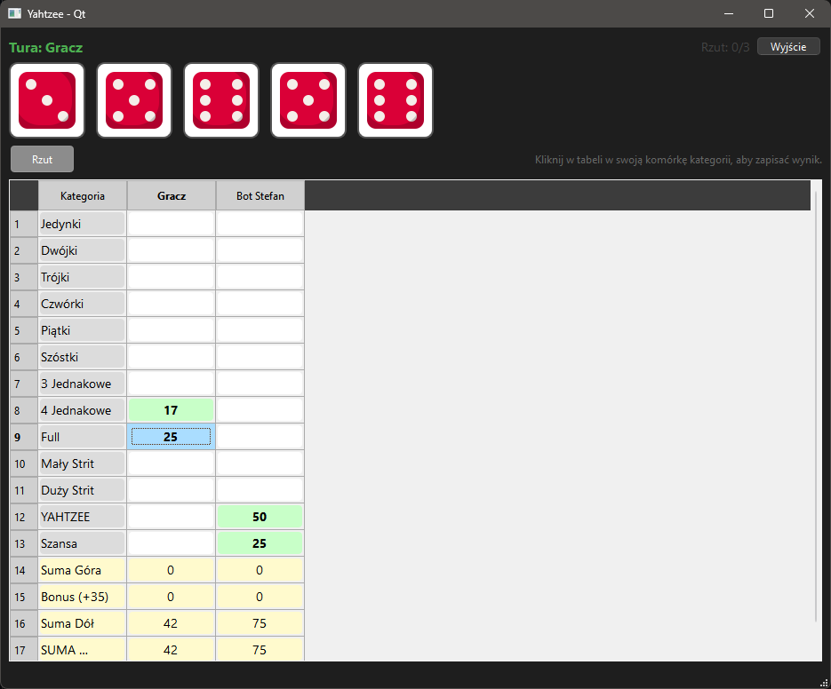
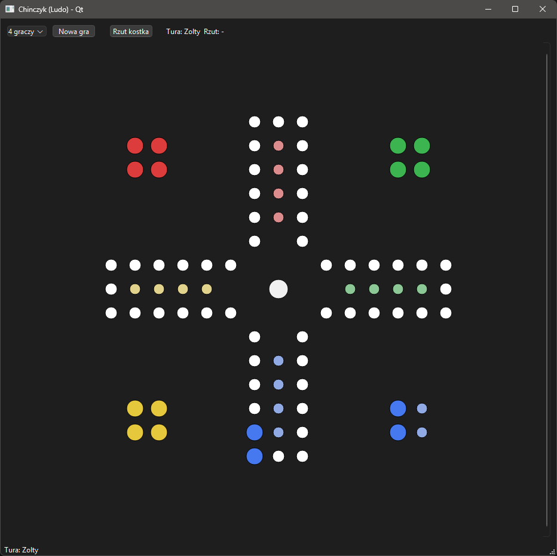

# MultiGame Launcher (Qt6 / C++)

Zintegrowana platforma do gier logicznych i planszowych, oferująca rozgrywkę jednoosobową, lokalną (gorące krzesła) oraz sieciową w czasie rzeczywistym.

Projekt napisany w nowoczesnym C++17 z wykorzystaniem biblioteki Qt6 Widgets oraz modułu Qt Network.

---

## Główne Funkcjonalności

### Centralny Launcher
* **Modularność:** Jedno okno startowe zarządzające wszystkimi grami.
* **Konfiguracja sieci:** Możliwość wyboru roli (Host/Klient), adresu IP oraz portu bezpośrednio z menu.
* **Tryby gry:** Wybór między grą Solo, Lokalną (Hotseat) a Sieciową.

### Tryb Sieciowy (TCP/IP)
Autorska implementacja protokołu komunikacyjnego opartego na QTcpSocket:
* **Architektura Klient-Serwer:** Host zarządza logiką i stanem gry, Klienci synchronizują UI.
* **Płynność:** Natychmiastowa aktualizacja stanu planszy i wyników u wszystkich graczy.
* **Obsługa błędów:** Komunikaty o zerwaniu połączenia i walidacja pakietów danych (JSON/Text).

---

## Dostępne Gry

### 1. Wisielec (Hangman)
Klasyczna gra słowna w nowoczesnym wydaniu.
* **Logika:** Dynamiczne skalowanie rysowania szubienicy (QPainter) zależne od postępów.
* **Baza słów:** Wbudowany generator haseł dla trybu Solo.
* **Sieć:** W trybie online jeden gracz pełni rolę "Kata" (ustawia hasło), a drugi zgaduje.
* **Rewanż:** Możliwość zamiany ról (ustawiający/zgadujący) po zakończeniu rundy bez rozłączania.

### 2. Kości (Yahtzee)
Strategiczna gra losowa oparta na zasadach Yahtzee.
* **Pełna mechanika:** 13 kategorii punktowania (m.in. Strit, Full, Kareta, Generał).
* **Interakcja:** Możliwość blokowania wybranych kości między rzutami (do 3 rzutów w turze).
* **Bot:** W trybie Solo gracz mierzy się z komputerowym przeciwnikiem podejmującym decyzje oparte na rachunku prawdopodobieństwa.
* **UI:** Tabela wyników na żywo z podświetlaniem aktualnej tury i dostępnych ruchów.

---

## Galeria

| Launcher | Wisielec |
| :---: | :---: |
|  |  |
| *Menu główne i konfiguracja* | *Gra sieciowa z podglądem hasła* |

| Kości (Yahtzee) | Chińczyk (Ludo) |
| :---: | :---: |
|  |  |
| *Rozgrywka z botem i tabela wyników* |*Plansza do gry i rzut kością* |

---

## Technologie

Projekt wykorzystuje wyłącznie standardowe biblioteki Qt, bez zewnętrznych zależności.

* **Język:** C++17
* **Framework:** Qt 6.7+
* **Moduły Qt:** Core, Gui, Widgets, Network
* **System budowania:** CMake
* **Format danych:** JSON (do komunikacji sieciowej w grze Kości)

---

## Instalacja i Uruchomienie

### Wymagania
* Kompilator C++ (GCC, MinGW, MSVC)
* Biblioteka Qt6
* CMake
